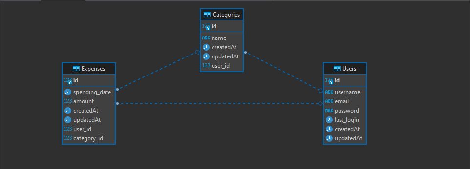

# tarjama-assignment

## Overview
 A candidate is required to build a backend application which manages the expenses of individuals, the only need is the backend API’s and nothing else.

## Modules

- **The application consists of 3 modules:**

    1.	Users: represents the users of the application, the individuals who want to store their experiences.
    2.	 Categories: represents the type to which the expenses belong, ex: invoices, grocery, car fuel, schools, medical, insurance.
    3.	Expenses: represents the expenses themselves, ex. The user X spent JOD 10 on Feb 15, 2022, as a grocery purchase

## ER Diagram

## Routes

### **Auth Route**

| **method** | **link**       | **Description**                         |
| ---------- | -------------- | --------------------------------------- |
| POST       | /user/signup        | Signup                                  |
| POST       | /user/signin        | Signin                                  |

### **Expenses Route**

| **method** | **link**        | **Description**         |
| ---------- | --------------- | ----------------------- |
| GET        | /expenses      | List By (day, month, year)  |
| POST       | /expenses      | Create Expenses        |
| PUT        | /expenses /:id | Update Expenses        |
| DELETE     | /expenses /:id | Delete Expenses        |

### **Category  Route**

| **method** | **link**        | **Description**         |
| ---------- | --------------- | ----------------------- |
| GET        | /expenses      | List Category  |
| GET        | /driverinfo/:id | Get Specific Category |
| POST       | /expenses      | Create Category        |
| PUT        | /expenses /:id | Update Category        |

## Installation

- Install the dependencies and devDependencies and start the server.

1. cd tarjama-assignment

2. npm i

3. npm run dev

